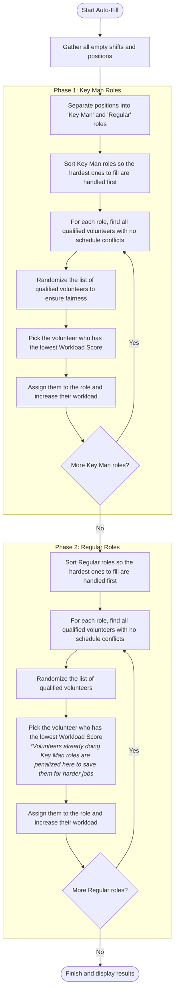

# Auto-Fill Logic

The following diagram explains how the scheduling Auto-Fill system works to fairly assign volunteers to open positions.

```mermaid
flowchart TD
    A([Start Auto-Fill]) --> B[Gather all empty shifts and positions]

    B --> C[Separate positions into 'Key Man' and 'Regular' roles]

    subgraph Phase 1: Key Man Roles
        C --> D[Sort Key Man roles so the hardest ones to fill are handled first]
        D --> E[For each role, find all qualified volunteers with no schedule conflicts]
        E --> F[Randomize the list of qualified volunteers to ensure fairness]
        F --> G[Pick the volunteer who has the lowest Workload Score]
        G --> H[Assign them to the role and increase their workload]
        H --> I{More Key Man roles?}
        I -- Yes --> E
    end

    subgraph Phase 2: Regular Roles
        I -- No --> J[Sort Regular roles so the hardest ones to fill are handled first]
        J --> K[For each role, find all qualified volunteers with no schedule conflicts]
        K --> L[Randomize the list of qualified volunteers]
        L --> M[Pick the volunteer who has the lowest Workload Score<br/><i>*Volunteers already doing Key Man roles are penalized here to save them for harder jobs</i>]
        M --> N[Assign them to the role and increase their workload]
        N --> O{More Regular roles?}
        O -- Yes --> K
    end

    O -- No --> P([Finish and display results])
```
